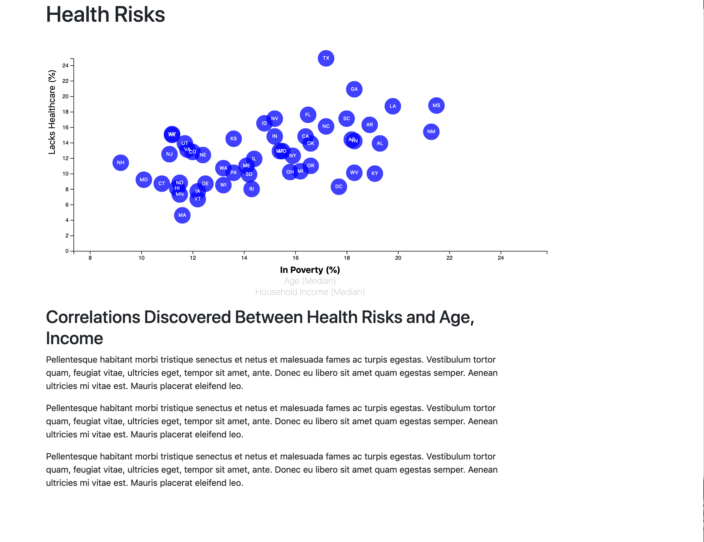
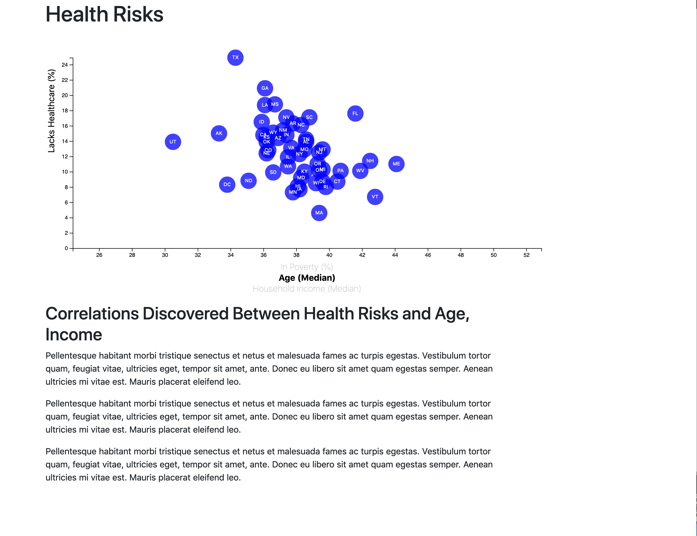
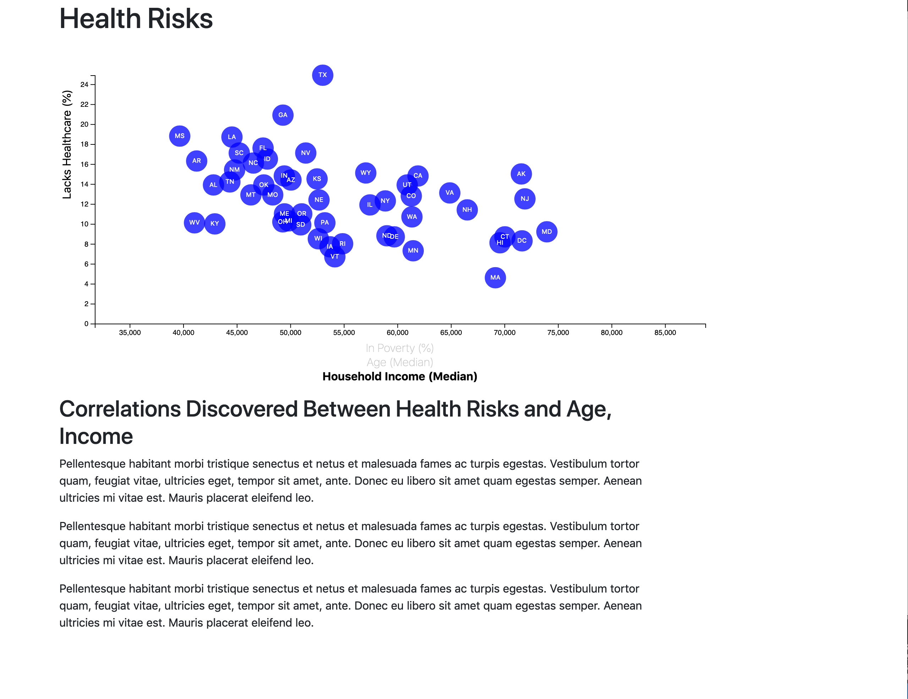

# interactive_visualization

Interactive chart looking at the relationship between Lacks Healthcare(%) vs. In Poverty(%)/Age(Median)/Household Income(Median) in each U.S state. Clicking different chart labels will activate the circles to transition to show different data. Using d3-tip, mousing over each circle will show the state name and x and y values. 

Technologies used:
-JavaScript
-D3.js
-d3-tip.js
-HTML
-CSS

Data Source: U.S. Census Bureau and the Behavioral Risk Factor Surveillance System

Screenshots:

